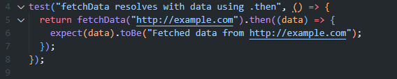
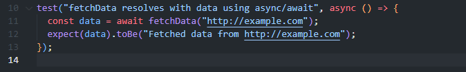
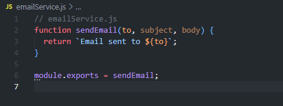
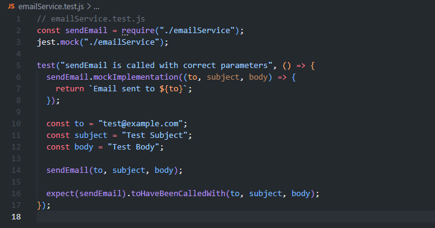

# Objective
Deepen your proficiency with Jest by tackling complex testing scenarios, including asynchronous functions and mocking external dependencies. This assignment will guide you through specific tasks to enhance your understanding of Jest's capabilities in testing real-world applications.

# Instructions
## Part 1: GitHub Repository Setup
### Create Repository:

On GitHub, create a repository named advanced-jest-features.
Initialize it with a .gitignore for Node.js and a basic README.md.

### Local Environment Setup:

Clone advanced-jest-features to your local machine.
Run npm init -y to generate a package.json.
Install Jest using npm install --save-dev jest.

### Configure a test script in package.json:
"scripts": {
  "test": "jest"
}
 
## Part 2: Asynchronous Testing
### Function Implementation:

In dataFetcher.js, implement fetchData(url) that simulates fetching data by returning a promise that resolves to "Fetched data from ${url}" after a 1-second delay.

### Write Asynchronous Tests:

Create dataFetcher.test.js.
Test fetchData using .then for a URL "http://example.com".

Write another test using async/await for the same URL.

## Part 3: Introduction to Mocking
### Mocking Setup:

In emailService.js, write a function sendEmail(to, subject, body) that simulates sending an email.
This function simply returns "Email sent to ${to}".

### Mocking Tests:

In emailService.test.js, mock sendEmail to test without actually sending emails.
Verify that sendEmail is called with correct parameters when you invoke it in your test.

## Part 4: Submission and Documentation
### Update README.md:
Explain how to run tests.
- To run the tests, simply enter the command:  
  npm test  
  
Describe the purpose of each function and the rationale behind your test cases, including how mocking is employed.  
  
- fetchData(url) mimics fetching data from a site URL. It returns a promise to resolve "Fetched data from ${url}". It does this after a 1-second delay.
- sendEmail mimics sending an email without actually sending one and returns "Email sent to ${to}".
- The tests simulate the functions without actually fetching data or sending anything, and they verify that the sendEmail function is invoked with the correct parameters.

## Credits
Credit to ChatGPT for assistance and code comments.